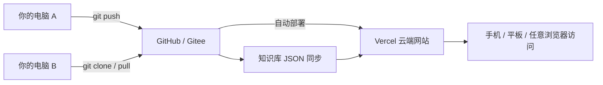

# 云端部署指南

让网站在任何电脑/手机上可访问，代码和知识库数据在云端同步，换电脑也能继续改。

## 推荐架构



| 组件 | 作用 | 推荐服务 |
|------|------|----------|
| 代码仓库 | 存代码 + 知识库 JSON，多电脑同步 | [GitHub](https://github.com) 或 [Gitee](https://gitee.com) |
| 网站托管 | 自动构建、提供公网访问地址 | [Vercel](https://vercel.com)（免费，Next.js 首选） |
| AI 密钥 | 识图 API，不进代码库 | Vercel 环境变量后台配置 |

---

## 一、前置准备（一次性）

### 1. 安装 Git

Windows 下载：https://git-scm.com/download/win

安装后重启终端，验证：

```bash
git --version
```

### 2. 注册账号

- **GitHub**：https://github.com/signup（国际，配 Vercel 最省事）
- 或 **Gitee**：https://gitee.com/signup（国内访问更快）

### 3. 注册 Vercel

https://vercel.com/signup（可用 GitHub 账号直接登录）

---

## 二、上传代码到 GitHub

在项目目录执行：

```bash
cd C:\Users\LMY\Projects\walnut-knowledge

git init
git add .
git commit -m "初始版本：文玩核桃知识库"

# 在 GitHub 网页新建空仓库 walnut-knowledge，然后：
git remote add origin https://github.com/你的用户名/walnut-knowledge.git
git branch -M main
git push -u origin main
```

> 注意：`.env.local` 已在 `.gitignore` 中，API 密钥不会被上传。

---

## 三、部署到 Vercel（约 3 分钟）

1. 登录 https://vercel.com
2. 点击 **Add New → Project**
3. 选择 **Import Git Repository**，选中 `walnut-knowledge`
4. 框架会自动识别为 **Next.js**，直接点 **Deploy**
5. 部署完成后获得地址，例如：`https://walnut-knowledge.vercel.app`

### 配置 AI 识图环境变量

Vercel 项目 → **Settings → Environment Variables**，添加：

| 变量名 | 值 | 说明 |
|--------|-----|------|
| `AI_PROVIDER` | `openai` 或 `dashscope` | 选择 AI 服务 |
| `OPENAI_API_KEY` | `sk-xxx` | 用 OpenAI 时填写 |
| `DASHSCOPE_API_KEY` | `sk-xxx` | 用通义千问时填写 |

保存后，在 **Deployments** 里点 **Redeploy** 使变量生效。

---

## 四、换电脑后如何继续修改

### 方式 A：本地开发（推荐）

```bash
git clone https://github.com/你的用户名/walnut-knowledge.git
cd walnut-knowledge
npm install
copy .env.example .env.local   # 填入 API Key
npm run dev
```

改完后：

```bash
git add .
git commit -m "更新品种数据"
git push
```

Vercel 会自动重新部署，约 1–2 分钟后线上网站更新。

### 方式 B：浏览器直接改知识库（无需装环境）

1. 打开 GitHub 仓库
2. 进入 `src/data/knowledge-base.json`
3. 点 **Edit（铅笔图标）** 修改内容
4. 点 **Commit changes**

Vercel 检测到推送后会自动更新线上网站。

### 方式 C：用 Cursor 云端 Agent

在 Cursor 中打开同一 GitHub 仓库，可在任意电脑用 AI 辅助修改，再 `git push` 同步。

---

## 五、知识库数据存在哪？

当前知识库是 **JSON 文件**，路径：

```
src/data/knowledge-base.json
```

它和代码一起放在 Git 仓库里，因此：

- 改 JSON = 改知识库内容
- `git push` 后网站自动更新
- 所有电脑拉同一份数据，不会乱

图片放在 `public/images/`，同样随 Git 同步。

---

## 六、国内访问加速（可选）

若 GitHub / Vercel 访问较慢，可以：

| 方案 | 说明 |
|------|------|
| Gitee + 腾讯云 Web 应用托管 | 代码放 Gitee，部署到国内节点 |
| GitHub + Vercel + 自定义域名 | 绑定国内已备案域名 |
| 仅代码放 Gitee，部署仍用 Vercel | 国内改代码快，网站走 Vercel |

---

## 七、后续可升级方向

当前 JSON 方案适合前期。若希望 **不写代码、网页上增删品种**，可后续加：

- 在线后台管理（Admin 页面）
- 云数据库（Supabase / 腾讯云数据库）
- 无头 CMS（如 Strapi、Notion API）

需要时可以再扩展，不影响现在的部署方式。

---

## 快速检查清单

- [ ] 安装 Git
- [ ] 创建 GitHub 仓库并 push 代码
- [ ] Vercel 导入仓库并部署
- [ ] 在 Vercel 配置 `OPENAI_API_KEY` 或 `DASHSCOPE_API_KEY`
- [ ] 浏览器打开 `https://你的项目.vercel.app` 验证
- [ ] 在另一台电脑 `git clone` 测试同步
